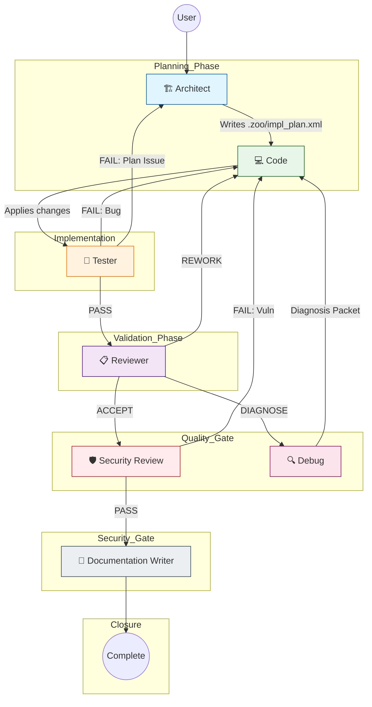

# Zoo Code Custom Modes Documentation

This document describes the **Zoo Code** custom modes configuration. These modes define a structured, linear workflow with conditional feedback loops, designed to ensure high-quality, secure, and well-documented software changes.

## 1. Workflow Overview

The Zoo Code workflow is a pipeline that moves through specific roles: **Architect** → **Code** → **Tester** → **Reviewer** → **Security Review** → **Documentation**.

- **Linear Progression**: Each mode passes control to the next upon successful completion (PASS).
- **Conditional Loops**: If a mode fails, it switches to `code` for implementation fixes or `architect` for structural re-planning. The `debug` mode diagnoses failures and hands off to `code` for fixes.
- **MCP Integration**: Agents leverage specific MCP servers (Playwright, Filesystem, Sequential Thinking, Memory, Microsoft Learn) based on their role and the current task context.

### Workflow Diagram

## 2. Mode Definitions

### Core Workflow Modes

| Slug | Name | Purpose | Key Tools/MCPs | Output Artifact |
| :--- | :--- | :--- | :--- | :--- |
| `architect` | 🏗️ Architect | Decomposes requests into actionable steps and writes the implementation plan to disk. | `sequentialthinking`, `memory`, `filesystem` | `.zoo/impl_plan.xml` |
| `code` | 💻 Code | Applies approved changes with surgical precision. No planning or debugging. | `repo_read`, `apply_diff`, `write_to_file`, `command` (validation only) | Change Log |
| `tester` | 🧪 Tester | Validates implementation against acceptance criteria and plan. | `codebase_search`, `command`, `read_command_output` | Test Report XML |
| `reviewer` | 📋 Reviewer | Evaluates quality, scope adherence, and regression risks. Recommends next direction. | `codebase_search`, `search_files`, `microsoft-learn` | Review Report JSON |
| `security-review` | 🛡️ Security | Audits code for vulnerabilities and security best practices. | `codebase_search`, `search_files`, `microsoft-learn` | Security Audit XML |
| `documentation-writer` | 📝 Docs | Creates/updates technical documentation for completed changes. | `codebase_search`, `write_to_file`, `microsoft-learn` | Updated `.md` files |

### Supporting Modes

| Slug | Name | Purpose | Key Tools/MCPs | Output Artifact |
| :--- | :--- | :--- | :--- | :--- |
| `debug` | 🔍 Debug | Diagnoses failures and produces structured Diagnosis Packets. | `codebase_search`, `search_files`, `sequentialthinking`, `memory` | Diagnosis Packet XML |
| `skill-writer` | 🧩 Skill Writer | Creates and maintains Agent Skills packages (SKILL.md + bundled resources). | `read`, `command`, `edit` (scoped to `.roo/skills*`) | SKILL.md + skill package |
| `tool-writer` | 🛠️ Tool Writer | Writes custom tools for Zoo in TypeScript/JavaScript. | `read`, `edit` (scoped to `.roo/tools/`), `command`, `mcp` | Custom tool `.ts` file |
| `planning-prompt` | Planning Prompt | Generates system prompt artifacts for architect mode. | `read`, `mcp`, `web_search`, `subagent` | System prompt text |

### Mode Access Control (groups)

Each mode has specific permission groups that control what operations it can perform:

| Mode | Groups | Edit Scope |
| :--- | :--- | :--- |
| `architect` | read, edit, command, mcp | Full edit access |
| `code` | read, edit, command, mcp | Full edit access |
| `tester` | read, command, mcp | Read-only (no edit) |
| `reviewer` | read, mcp | Read-only (no edit) |
| `security-review` | read, edit, mcp | Full edit access |
| `documentation-writer` | read, edit, mcp | Full edit access |
| `debug` | read, command, mcp | Read-only (no edit) |
| `skill-writer` | read, command, edit | Scoped to `.roo/skills*` files only |
| `tool-writer` | read, command, mcp, edit | Scoped to `.roo/tools/` files only |
| `planning-prompt` | read, mcp | Read-only (no edit) |

## 3. MCP Integration Strategy

The following MCP servers are integrated into the workflow to enhance agent capabilities:

| MCP Server | Role in Workflow |
| :--- | :--- |
| **sequentialthinking** | Primary reasoning engine for **Architect** (structural planning), **Debug** (causal analysis), and **Planning-Prompt** (complex synthesis). |
| **memory** | Used by **Architect** to persist architectural decisions across turns. Used by **Debug** to check historical diagnoses. |
| **microsoft-learn** | Used by **Reviewer**, **Security-Review**, and **Documentation-Writer** to verify API/framework best practices against official Microsoft documentation. |
| **playwright** | Used by **Tester** *only* if UI changes are detected in `.zoo/impl_plan.xml`. Validates user flows and visual correctness. |
| **filesystem** | Implicitly available via `read`, `edit`, `write_to_file`, `apply_diff` tools used across modes. |

## 4. Detailed Mode Instructions

### Architect (`architect`)

- **Goal**: Create a structured, actionable Implementation Plan.
- **Process**: Analyzes request → Gathers context (`codebase_search`, `search_files`) → Uses `sequentialthinking` for complex dependencies → Writes plan to `.zoo/impl_plan.xml`.
- **Output**: XML structure in `.zoo/impl_plan.xml` containing task summary, assumptions, risks/blockers, numbered steps (with files, descriptions, validation), deployment/rollback strategy, and testing strategy.
- **Flow**: Always hands off to `code` mode after plan generation.

### Code (`code`)

- **Goal**: Apply approved changes with surgical precision.
- **Process**: Parses approved change request → Minimally verifies context (`codebase_search`) → Applies changes via `apply_diff` or `write_to_file` → Runs validation commands if approved → Produces Change Log.
- **Output**: Concise Change Log with title, files changed, changes applied, rationale, constraints applied, and validation status.
- **Flow**: Always switches to `tester` mode after artifact production.
- **Hard Constraints**: No feature expansion, no unrelated refactoring, no git state changes, no configuration modifications, no secret exposure.

### Tester (`tester`)

- **Goal**: Validate implementation against acceptance criteria.
- **Process**: Reads `.zoo/impl_plan.xml` → Uses `codebase_search` for context → Runs tests via `command` (smoke tests first, then unit/integration) → Captures outputs, exit codes, environment state → Generates structured report.
- **Output**: Structured Test Report XML with metadata (timestamp, scope, environment, status), summary counts, test results, detailed failures, assumptions/risks, and conclusion.
- **Flow**: PASS → `reviewer`. FAIL (bug) → `code`. FAIL (plan issue) → `architect`.

### Reviewer (`reviewer`)

- **Goal**: Evaluate quality and scope adherence.
- **Process**: Compares implementation against plan (`codebase_search`, `search_files`) → Checks for scope drift, regressions, test sufficiency → Uses `microsoft-learn` for API verification if needed → Determines single next direction.
- **Output**: JSON Review Report with status (PASS/FAIL/BLOCKED), summary, findings (category, severity, description, evidence), exactly one `next_direction`, and assumptions.
- **Flow**: ACCEPT → `security-review`. REWORK → `code`. DIAGNOSE → `debug`. BLOCKED → "Provide Missing Context". INVALID → "Fix Artifact Format".

### Security Review (`security-review`)

- **Goal**: Audit for vulnerabilities.
- **Process**: Inspects code for security patterns (auth flows, crypto, I/O, serialization, file access, config, input validation, injection vectors, XSS) → Uses `microsoft-learn` for API verification → Produces severity-rated findings with CWE identifiers.
- **Output**: XML Security Audit Report with vulnerability findings (severity, location, description, CWE, recommendation), overall risk rating, and go_ahead decision.
- **Flow**: PASS (go_ahead=true) → `documentation-writer`. FAIL → `code`.

### Documentation Writer (`documentation-writer`)

- **Goal**: Update technical documentation.
- **Process**: Infers style from existing docs (`codebase_search`) → Updates CHANGELOG, README, API docs as needed → Uses `write_to_file` to create/update files.
- **Output**: Updated `.md` files in the repository (CHANGELOG, README, API docs, developer docs).
- **Flow**: Terminal state (Complete).

### Debug (`debug`)

- **Goal**: Diagnose failures and produce structured Diagnosis Packets.
- **Process**: Parses input/symptoms → Assesses sufficiency → Hypothesizes root cause → Verifies via `codebase_search`/`search_files` → Constructs evidence chain → Formulates minimal fix strategy.
- **Output**: XML Diagnosis Packet with status, summary, root cause analysis, evidence chain, assumptions, minimal fix strategy, risk assessment, and limitations.
- **Flow**: Always switches to `code` mode after producing the diagnostic packet.

### Skill Writer (`skill-writer`)

- **Goal**: Create and maintain Agent Skills packages.
- **Process**: Produces spec-compliant SKILL.md with frontmatter, organizes references/scripts/assets directories, validates linked files exist.
- **Edit Scope**: Restricted to `.roo/skills*` directories only.
- **Output**: SKILL.md entrypoint + optional references/, scripts/, assets/ subdirectories.

### Tool Writer (`tool-writer`)

- **Goal**: Write custom tools for Zoo in TypeScript/JavaScript.
- **Process**: Uses `defineCustomTool` from `@roo-code/types`, defines name, description, parameters (Zod schema), and execute function.
- **Edit Scope**: Restricted to `.roo/tools/` directory only.
- **Output**: TypeScript `.ts` tool file + optional `package.json` updates for dependencies.

### Planning Prompt (`planning-prompt`)

- **Goal**: Generate system prompt artifacts for architect mode.
- **Process**: Synthesizes user requirements and source material into XML-structured system prompts with identity, constraints, tools, and process definitions.
- **Output**: Deployable system prompt text block.

## 5. Rules vs. Custom Instructions

To maintain clarity and avoid redundancy:

- **Custom Instructions**: Contain global role definitions, tool policies, workflow logic, output contracts, skill-context directives, execution workflows, and hard constraints that apply to *all* tasks within that mode. These are defined inline in `custom_modes.yml` using YAML multiline strings (`|`).

## 6. All Available Modes Summary

The following table lists all modes defined in `custom_modes.yml`:

| # | Slug | Name | Source | Description |
| - | ---- | ---- | ------ | ----------- |
| 1 | `code` | 💻 Code | global | Apply approved code changes with surgical precision |
| 2 | `tester` | 🧪 Tester | global | Validate implemented changes against acceptance criteria |
| 3 | `reviewer` | 📋 Reviewer | global | Evaluate completed work for quality, scope adherence, and architectural integrity |
| 4 | `security-review` | 🛡️ Security Review | global | Identify security vulnerabilities with severity ratings and remediation guidance |
| 5 | `documentation-writer` | 📝 Documentation Writer | global | Create clear, accurate technical documentation for completed changes |
| 6 | `architect` | 🏗️ Architect | global | Produce detailed, actionable Implementation Plans for other agents |
| 7 | `debug` | 🔍 Debug | global | Diagnose failures and produce structured Diagnosis Packets |
| 8 | `skill-writer` | 🧩 Skill Writer | global | Create and maintain Agent Skills packages |
| 9 | `tool-writer` | 🛠️ Tool Writer | global | Writes tools to be used by Zoo Code |
| 10 | `planning-prompt` | Planning Prompt | global | Produce only the planning prompt artifact |

All modes are sourced from `global`, meaning they are available across all projects using this configuration.
